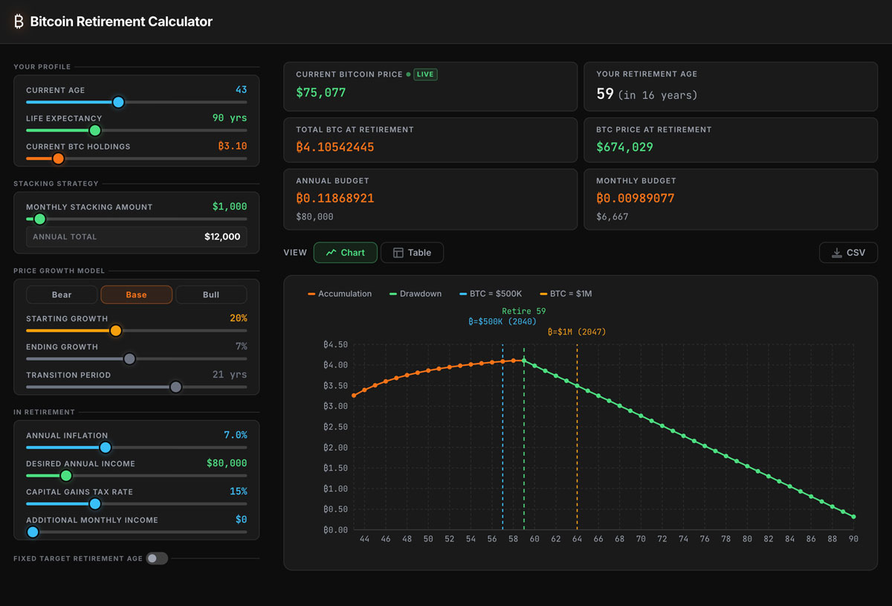

# Bitcoin Retirement Calculator

A personal retirement planning tool that simulates how a Bitcoin stack grows and is drawn down over your lifetime — from accumulation through retirement to estate.



---

## Features

### Live Bitcoin Price
- Fetches the current BTC price in real time via an external price API
- Falls back to a default price if the API is unavailable
- Displayed in the stats panel with a live indicator

---

### Input Panel

#### Your Profile
| Input | Range | Description |
|---|---|---|
| Current Age | 10–90 | Your age today |
| Life Expectancy | 75–125 | Projected lifespan used to bound the simulation |
| Current BTC Holdings | 0–25 BTC | Your existing stack at the start of the simulation |

#### Stacking Strategy
| Input | Range | Description |
|---|---|---|
| Monthly Stacking Amount | $0–$30,000 | USD bought and converted to BTC each month during accumulation |

The panel also shows the computed annual stacking total.

#### Price Growth Model
Configure how BTC price is expected to grow over time using a smooth linear interpolation from a higher early growth rate down to a mature long-term rate.

| Input | Range | Description |
|---|---|---|
| Starting Growth | 0–50% | Annual growth rate at the start of the simulation |
| Ending Growth | 0–15% | Long-term annual growth rate after transition |
| Transition Period | 1–30 years | Years over which growth decelerates from start to end |

**Quick presets:** Bear (15%), Base (20%), Bull (30%) starting growth.

#### In Retirement
| Input | Range | Description |
|---|---|---|
| Annual Inflation | 0–20% | Applied to drawdown spending each year to maintain real purchasing power |
| Desired Annual Income | $0–$500,000 | Target after-tax annual spend in retirement (in today's dollars) |
| Capital Gains Tax Rate | 0–50% | Tax applied to the gain portion of each BTC sale |
| Additional Monthly Income | $0–$10,000 | Other income sources (Social Security, pension, rental, etc.) that reduce how much BTC needs to be sold |

#### Fixed Target Retirement Age (toggle)
When enabled, you set a specific retirement age and the calculator solves for the **maximum sustainable annual income** that depletes your stack to zero by your life expectancy. When disabled, the calculator finds the **earliest age** at which your stack can support your desired income.

---

### Output Panel

#### Stats Grid
| Stat | Description |
|---|---|
| Current Bitcoin Price | Live market price with a real-time indicator |
| Your Retirement Age | Age when retirement conditions are met, with years-away annotation |
| Total BTC at Retirement | Your full stack size at the moment of retirement |
| BTC Price at Retirement | Projected price on your retirement date |
| Budget (Annual / Monthly) | Drawdown budget in both BTC and USD, including additional income sources |
| Legacy Estate | Remaining BTC (and USD value) at end of life; shown as "Stack fully drawn down" if depleted |

#### Chart View
Interactive line chart visualising BTC holdings year by year:

- **Orange line** — accumulation phase (holdings growing)
- **Green line** — drawdown phase (holdings declining)
- **Green dashed reference line** — retirement age marker
- **Sky blue dashed reference line** — year BTC price reaches $500,000 (with calendar year)
- **Amber dashed reference line** — year BTC price reaches $1,000,000 (with calendar year)

Hover over any point to see a tooltip with age, BTC holdings, BTC price, portfolio value, and annual spend.

#### Table View
Full year-by-year data table with columns:

| Column | Description |
|---|---|
| Year | Calendar year |
| Age | Your age (retirement year is highlighted with a RETIRE badge) |
| BTC Holdings | Stack size in BTC |
| BTC Price | Projected price |
| Stack Value | Portfolio value in USD |
| Annual (USD / BTC) | Annual drawdown spend in both currencies |
| Monthly (USD / BTC) | Monthly equivalent of the annual spend |
| Tax Paid (USD) | Capital gains tax paid on each year's BTC sales |

---

## How the Simulation Works

1. **Accumulation** — Each year before retirement, the monthly stacking amount is bought at the projected BTC price. The weighted average cost basis is updated continuously.

2. **Retirement trigger** — In normal mode, retirement fires at the first age where an inflation-adjusted annuity drawing from the stack can cover your desired income to life expectancy. In fixed-target mode, retirement fires at the chosen age and income is solved to exactly deplete the stack.

3. **Drawdown** — Each post-retirement year, BTC is sold to fund the inflation-adjusted spend. Capital gains tax is calculated on the gain fraction only (based on the weighted average cost basis), so you never overpay on already-taxed cost basis. Any additional monthly income reduces the BTC sold.

4. **Estate** — Any BTC remaining at life expectancy is reported as the legacy estate value.

---

## Tech Stack

- **React 19** with TypeScript
- **Vite** for bundling and dev server
- **Recharts** for the interactive chart
- **CSS Modules / SCSS** for component-scoped styling

## Running Locally

```bash
npm install
npm run dev
```
